# **ReadFlow — University Library Management System**

**ReadFlow** is a **full-stack library management system** built using **Next.js 14**, **React**, **TypeScript**, **PostgreSQL**, **Redis**, **Drizzle ORM**, **Auth.js**, and **ImageKit**.  
The project includes a **public user application** and a **secure admin dashboard** with full authentication, file uploads, caching, workflows, and a complete borrowing system.

---

## **Features**

### **User Application**
- **Personalized onboarding**
- **Advanced book filtering**
- **Book details with availability**
- **Borrowing system with due dates**
- **User dashboard**
- **Email notifications**
- **Fully responsive UI**

### **Admin Dashboard**
- **Admin authentication**
- **Analytics dashboard**
- **Manage books (Create, Update, Delete)**
- **Manage users**
- **Image uploads using ImageKit**
- **Upload progress indicator**
- **Category color system**
- **Toast notifications**

### **Authentication**
- **Email and password login**
- **JWT sessions**
- **Role-based access (Admin / User)**
- **Protected routes**
- **Automatic redirects**

### **Backend and Database**
- **PostgreSQL (Neon)**
- **Drizzle ORM schemas and migrations**
- **CRUD operations**
- **Borrowing record system**
- **Due-date logic**
- **Redis caching**
- **IP-based rate limiting**
- **Error handling and validation**

### **File Uploads**
- **ImageKit CDN integration**
- **Secure upload signatures**
- **Upload progress UI**
- **File validation**

---

## **Tech Stack**

**Frontend:** Next.js 14, React, TypeScript, Tailwind CSS, ShadCN UI, React Hook Form, Zod  
**Backend:** PostgreSQL, Drizzle ORM, Redis, Next.js Server Actions, Auth.js, ImageKit  
**Other Tools:** ESLint, Prettier, Environment Variables, Neon Serverless Database

---

## **Installation and Setup**

### **1. Clone the Repository**
git clone https://github.com/yourusername/readflow.git  
cd readflow

### **2. Install Dependencies**
npm install

### **3. Add Environment Variables**
Create a file named **.env.local**:

DATABASE_URL=  
IMAGEKIT_URL_ENDPOINT=  
IMAGEKIT_PUBLIC_KEY=  
IMAGEKIT_PRIVATE_KEY=  
REDIS_URL=  
AUTH_SECRET=

### **4. Run Migrations**
npm run db:migrate

### **5. Start the Development Server**
npm run dev

---

### **6. ScreenShots**

## 📸 Screenshots

### 🏠 Home & Dashboard
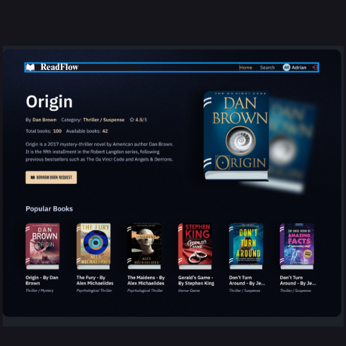
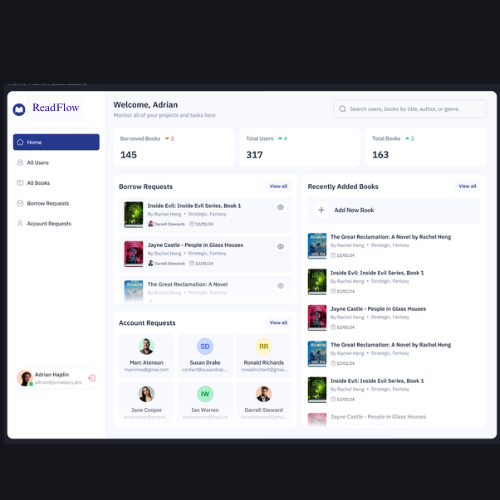
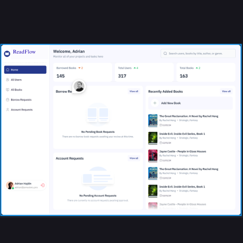

### 🔐 Authentication
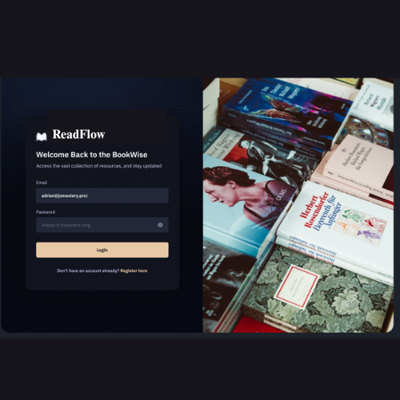
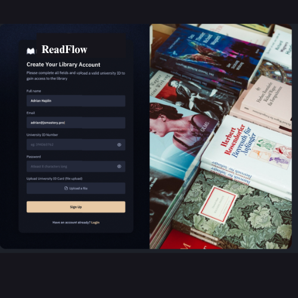
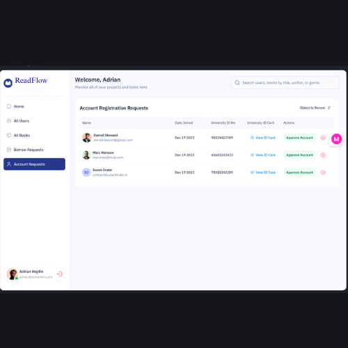

### 📚 Books & Details
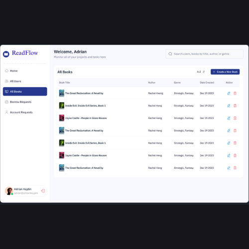
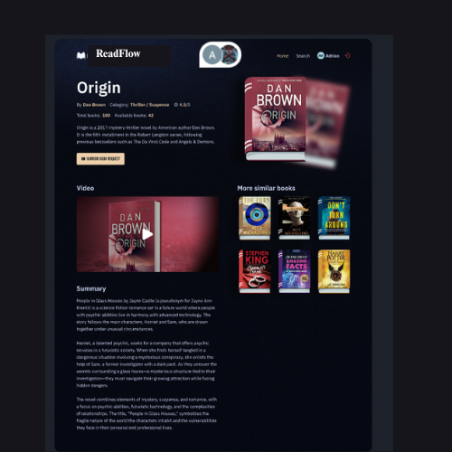
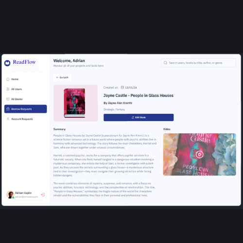
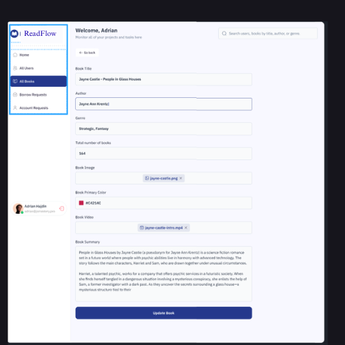

### 🔍 Search

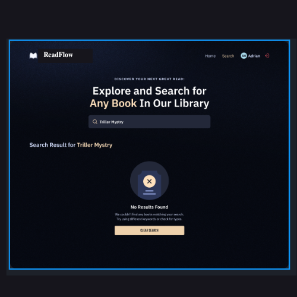

### 👤 User
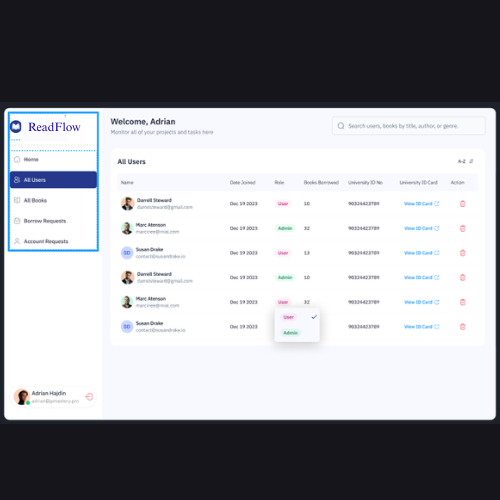
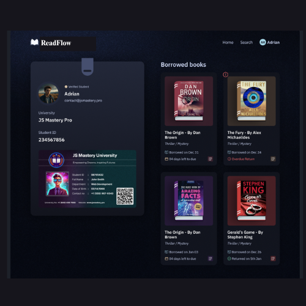

